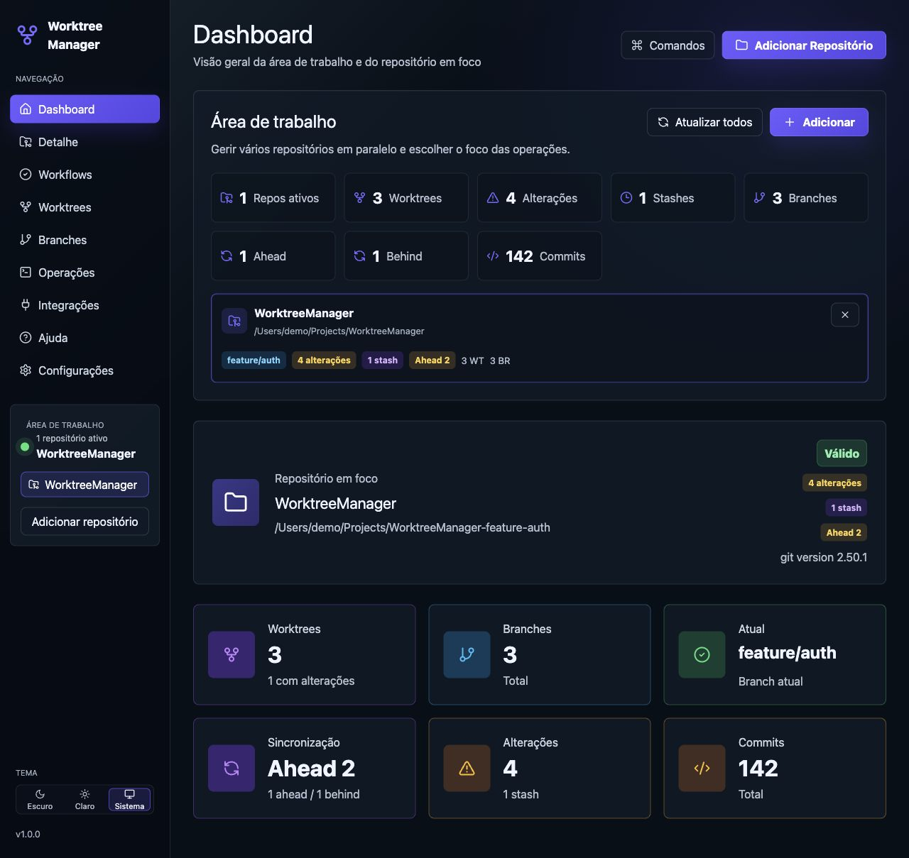
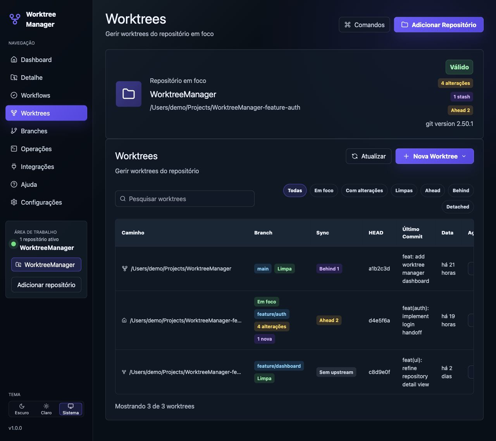
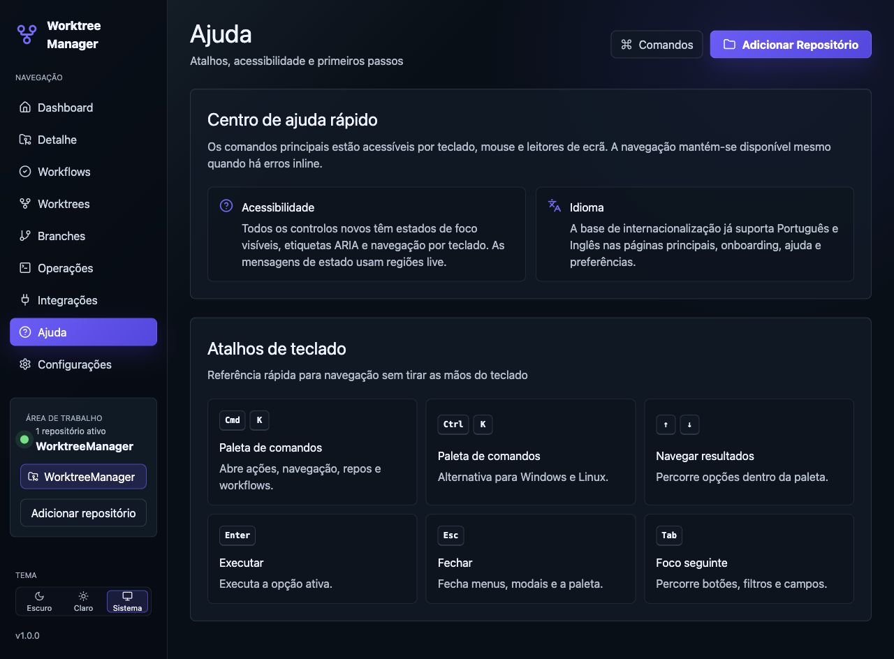
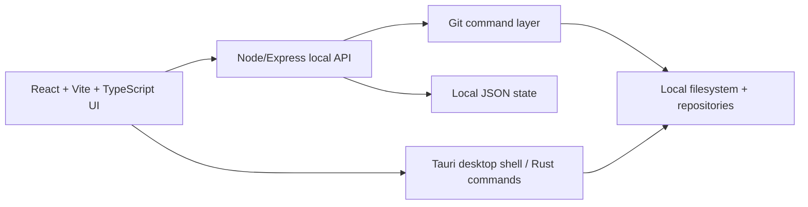

# Worktree Manager

A local-first desktop/web app for managing Git repositories, worktrees, branches, handoffs, and day-to-day parallel development.

Worktree Manager is designed for developers who regularly split work across branches, experiments, reviews, and hotfixes, and want the same kind of explicit worktree control that advanced coding agents and terminal-heavy workflows rely on.



## Highlights

- Manage multiple Git repositories in one workspace.
- Inspect worktrees, branches, ahead/behind state, dirty files, stashes, and recent Git operations.
- Move work between the local workspace and existing worktrees with guided, pre-confirmed handoff flows.
- Use safe-mode Git operations with explicit confirmations for sensitive actions.
- Open any worktree in the configured editor, terminal, or file explorer.
- Use a command palette, guided workflows, search, filters, dark/light/system themes, and PT/EN interface foundations.
- Review local data, diagnostics, and privacy behavior on the Data and Privacy page.
- Run as a local web app during development and as a Tauri desktop app for distribution.



## Status

This project is in active MVP/professionalization work. The core local workflows are implemented, tests cover Git parsing/API/UI behavior, and Tauri packaging is in progress.

Distribution notes live in [docs/desktop-distribution.md](docs/desktop-distribution.md).
Release pipeline notes live in [docs/release-pipeline.md](docs/release-pipeline.md).

## Philosophy

Worktree Manager follows a few product principles:

- **Local first:** Git operations run on the user's machine, against local repositories.
- **Explicit over magical:** destructive or branch-moving actions explain what will happen before they run.
- **Parallel work without confusion:** the app makes it clear which repository and worktree are in focus.
- **Safe Git by default:** commands use separated arguments, avoid shell interpolation, and preserve a local operation log.
- **Professional UI, not a toy dashboard:** dense information, keyboard navigation, visible states, and direct actions matter more than decorative surfaces.

## Screenshots



More visual test guidance is available in [docs/visual-e2e.md](docs/visual-e2e.md).

## Requirements

- Git.
- Node.js 22 or newer.
- npm.
- Rust and Cargo for Tauri desktop builds.
- Platform-specific Tauri system dependencies for desktop packaging.

## Install

```bash
git clone <repo-url>
cd worktree-manager
npm ci
```

## Run Locally

Start the local backend and frontend together:

```bash
npm run dev
```

The frontend runs at `http://localhost:5173/`.
The local API runs at `http://127.0.0.1:4174`.

For stable demo data without touching real repositories, use:

```text
http://localhost:5173/?visual=1#dashboard
```

## Test And Build

```bash
npm test
npm run build
```

Desktop checks and builds:

```bash
npm run desktop:check-production
npm run desktop:info
npm run desktop:dev
npm run desktop:build
npm run desktop:build:windows
```

Windows installers are built by the GitHub Actions workflow in [.github/workflows/windows-installer.yml](.github/workflows/windows-installer.yml).
Stable, beta, and nightly release channels are documented in [docs/release-pipeline.md](docs/release-pipeline.md).

## Architecture



Main areas:

- `src/`: React UI, API clients, types, tests, visual mock mode.
- `server/`: Express API, Git command execution, diagnostics, local state.
- `src-tauri/`: Tauri app, Rust command layer, desktop configuration.
- `tests/`: API and Git parsing tests.
- `docs/`: distribution and visual E2E notes.
- `.github/`: workflows and community templates.

The backend executes Git with `child_process.spawn` and separated arguments. The Tauri layer is being evolved toward native local commands for a stronger desktop distribution story.
Production desktop builds use the Tauri command layer directly and reject accidental fallback to the local HTTP API.

## Security Model

- No authentication is included; this is a local single-user tool.
- The API is intended for localhost usage only.
- Packaged desktop builds do not depend on the localhost HTTP API.
- No remote telemetry is implemented.
- Nothing leaves the machine without a user-initiated action.
- Git commands are built from allowlisted operations and separated arguments.
- Sensitive operations require pre-confirmation in the UI.
- Operation logs capture stdout/stderr summaries for debugging without blocking navigation.

Report security issues privately using [SECURITY.md](SECURITY.md).
Read the privacy model in [docs/privacy.md](docs/privacy.md).

## Community

- Read [CONTRIBUTING.md](CONTRIBUTING.md) before opening a pull request.
- Follow [CODE_OF_CONDUCT.md](CODE_OF_CONDUCT.md).
- Check [ROADMAP.md](ROADMAP.md) for public direction and release blockers.
- Use the issue templates for bugs and feature requests.

## License

MIT. See [LICENSE](LICENSE).
